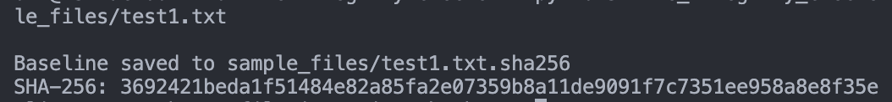
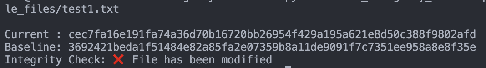
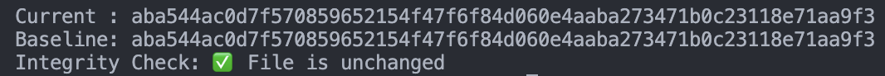

# 🛡️ File Integrity Checker

A Python project that demonstrates how to use **SHA-256 hashing** to verify if a file has been **modified or tampered with**.  
The script creates a baseline hash for any file and compares it later to check if the file is **unchanged** or **modified**.

---

## 🎯 Project Objectives
- Understand **file integrity** and **hashing** concepts.
- Learn to generate and compare **SHA-256 hashes** in Python.
- Practice documenting results with commands and screenshots.

---

## 🛠️ Tools & Libraries
- **Python 3.8+**  
- Built-in `hashlib` library (no external dependencies)

---

## 🚀 How to Use

### 1. Clone the Repository
```bash
git clone https://github.com/<your-username>/file-integrity-checker.git
cd file-integrity-checker
```

---

### 2. Run the Script
```bash
python3 file_integrity_checker.py sample_files/test1.txt
```
- First Run → Saves a baseline hash in test1.txt.sha256
- Second Run → Verifies the file against the baseline and shows if it's modified.

---

### 3. 🧪 Example Usage

✅ First Run — Baseline Saved



❌ File Modified



✅ File Verified



---

## 📌 Key Takeaways
- Hashing is a one-way process used to verify file integrity.
- If the hash changes, the file has been modified.
- Commonly used in cybersecurity to confirm data integrity.

Developed as part of my cybersecurity learning journey.
